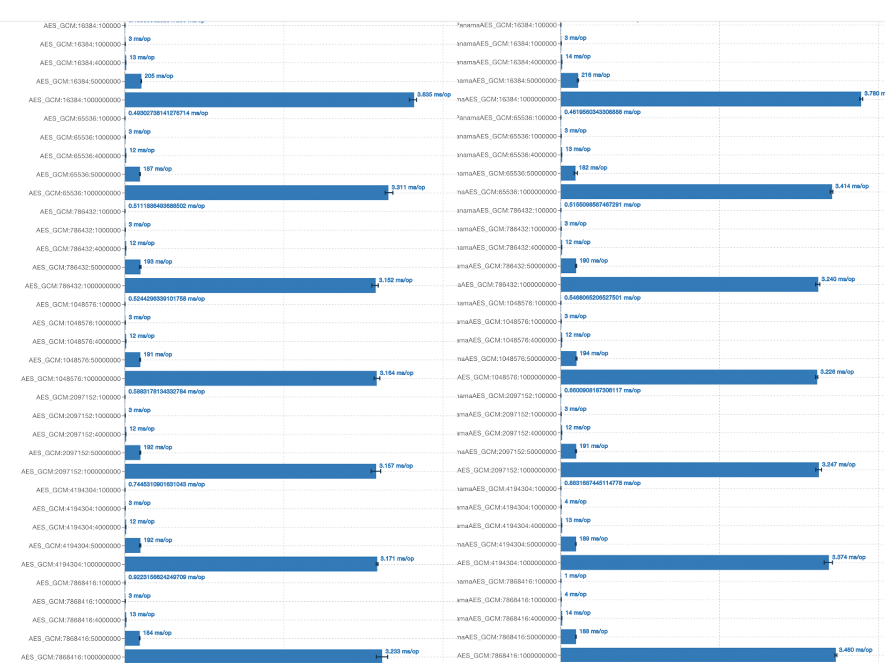
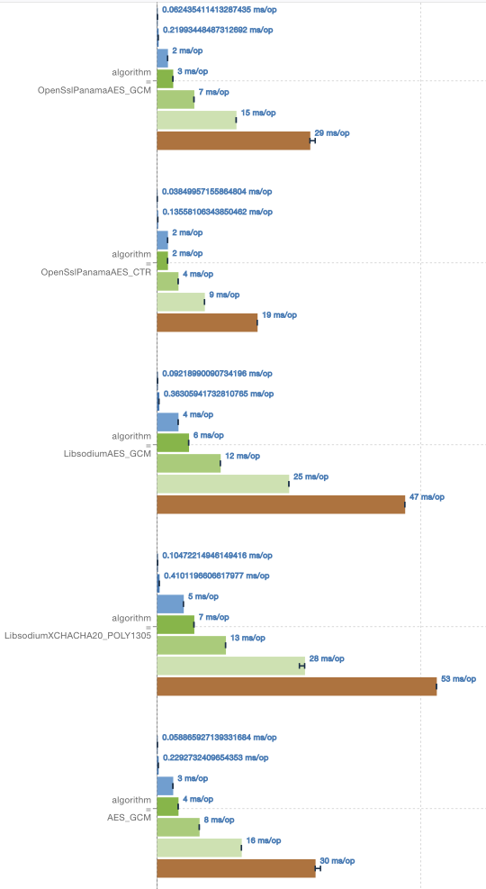
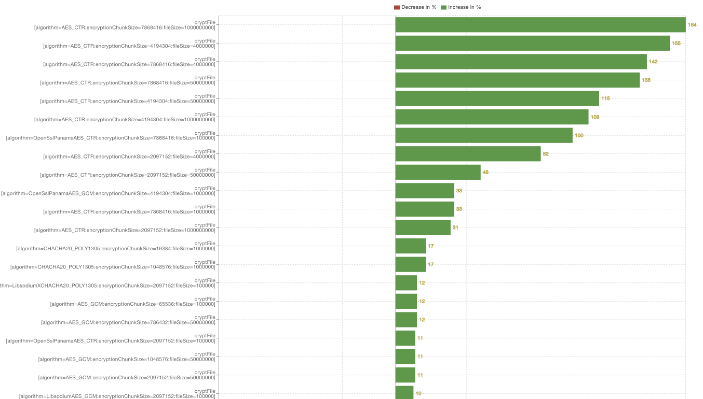

# Java Cipher Crypto Benchmark

[JMH](https://github.com/openjdk/jmh) based Benchmark Suite for comparing encryption and decryption performance of symmetric ciphers in Java.
The suite is designed to be easy to run and extend, allowing developers to quickly assess the performance of different cryptographic algorithms.

## Ciphers and modes

Compares the following ciphers:

* SunJCE AES GCM
* SunJCE AES CTR
* SunJCE ChaCha20-Poly1305
* OpenSSL AES GCM (via Panama foreign API bindings)
* OpenSSL AES CTR (via Panama foreign API bindings)
* Libsodium AES GCM (via Panama foreign API bindings)
* Libsodium XChaCha20-Poly1305 (via Panama foreign API bindings)

in two modes:

* File-based encryption (`cryptFile`)
* In-memory encryption (`cryptInMemory`)

## TL;DR

Results:

* SunJCE AES CTR is slow on Java ≤ 23 for large files/chunks due to a [bug in Java (fixed with Java 24)](https://bugs.openjdk.org/browse/JDK-8344766)
* SunJCE AES GCM is fast on all JDKs and outperforms OpenSSL AES GCM
* On Java 24 SunJCE AES CTR is fast and outperforms OpenSSL AES CTR
* **X**ChaCha20-Poly1305 is generally slower compared to AES but has some security advantages (see below)
* Libsodium AES GCM and SunJCE ChaCha20-Poly1305 are slow
* Chunk size is important and mostly optimal between 64KB and 1MB

## Recommendations

* Use chunks sizes between 64KB and 1MB
* SunJCE AES GCM is a great choice on all JDKs
* Do not use SunJCE AES CTR on Java ≤ 23 due to poor performance, use OpenSSL AES CTR
* If AES is not an option because of its limitations - use Libsodium **X**ChaCha20-Poly1305
* Avoid SunJCE ChaCha20-Poly1305 - its slow and does not add much better security margins or better implementation safety

## Raw Results

_Lower scores are better_

* [crypto-benchmark-result_1750146397444_Java21.json](crypto-benchmark-result_1750146397444_Java21.json)
* [crypto-benchmark-result_1750146397444_Java21.txt](crypto-benchmark-result_1750146397444_Java21.txt)
* [crypto-benchmark-result_1750198899771_Java24.json](crypto-benchmark-result_1750198899771_Java24.json)
* [crypto-benchmark-result_1750198899771_Java24.txt](crypto-benchmark-result_1750198899771_Java24.txt)

You can compare and analyze the JSON files via [JMH Visualizer](https://suresh.dev/jmh-bench-sample/) yourself

## Build and Run on MacOS/Linux

### Prequisites

* JDK 21 or JDK 24
* Maven 3.9.0 or higher
* OpenSSL 3.0.0 or later (for OpenSSL ciphers)
* libsodium 1.0.18 or later (for libsodium ciphers)
* CPU with AES-NI support
* On Linux make sure vm.max_map_count is sufficient: `sysctl -w vm.max_map_count=262144`

### Compile and Execute

```bash
#For Java21
mvn clean package
java -Xmx16g -Xms16g --enable-preview -jar target/crypto-benchmark-1.0.0-runnable.jar

#For Java 24 (Checkout the java24 branch)
git checkout java24
mvn clean package
java -Xmx16g -Xms16g -jar target/crypto-benchmark-1.0.0-runnable.jar
```

## Extend

To add new ciphers, implement the `CryptoAlgorithm` interface.

## Critical Warnings for AES

AES has significant security limitations that can lead to catastrophic failures if misused.

**Key Security Risks:**

* **Nonce reuse is catastrophic** - reusing the same nonce with the same key completely breaks confidentiality
* **Data volume limits** - there a maximum message sizes per nonce/key combinations and per key only
* **Nonce size constraints** - 96-bit nonces (GCM) are short
* **GHASH brittleness** - the underlying polynomial authentication is fragile and vulnerable to timing attacks (GCM)
* **Implementation complexity** - proper nonce generation and key rotation are critical and error-prone

**Safe Usage Requirements:**

* **Never reuse nonces** - implement robust nonce generation (counter-based or random with collision detection)
* **Rotate keys regularly** - before approaching data volume limits
* **Avoid AES software implementations** - AES-NI mitigates timing attack vulnerabilities in GHASH
* **Consider XChaCha20-Poly1305** for applications requiring higher security margins and better implementation safety

**References:**

* [https://libsodium.gitbook.io/doc/secret-key_cryptography/aead](https://libsodium.gitbook.io/doc/secret-key_cryptography/aead)
* [https://libsodium.gitbook.io/doc/secret-key_cryptography/aead/aes-256-gcm](https://libsodium.gitbook.io/doc/secret-key_cryptography/aead/aes-256-gcm)
* [https://csrc.nist.gov/csrc/media/Events/2023/third-workshop-on-block-cipher-modes-of-operation/documents/accepted-papers/Practical%20Challenges%20with%20AES-GCM.pdf](https://csrc.nist.gov/csrc/media/Events/2023/third-workshop-on-block-cipher-modes-of-operation/documents/accepted-papers/Practical%20Challenges%20with%20AES-GCM.pdf)
* [https://eprint.iacr.org/2024/051.pdf](https://eprint.iacr.org/2024/051.pdf)
* [https://soatok.blog/2020/05/13/why-aes-gcm-sucks/](https://soatok.blog/2020/05/13/why-aes-gcm-sucks/)

## Analysis

### Test Environment
- **Platform**: Linux Ubuntu 22.04 LTS (x86_64)
- **Processor**: AMD EPYC-Milan, 8 cores
- **JVM**: 16GB heap
- **Libraries**: Libsodium 1.0.18, OpenSSL 3.0.13
- **Benchmark**: JMH 1.37, 4 warmup iterations, 5 measurement iterations

### Java 21 (OpenJDK 21.0.7)

**File-based comparison OpenSSL AES GCM vs. SunJCE AES GCM**

SunJCE AES GCM on par and even outperforms OpenSSL AES GCM sometimes




**In-Memory comparison**



### Java 24 (OpenJDK 24.0.1)

Compared to the figures for Java 21 we see a massive speedup of AES CTR because of the [this bug in Java fixed with Java 24](https://bugs.openjdk.org/browse/JDK-8344766).
We also see slight improvements for all other Algorithms (with some outliers).

